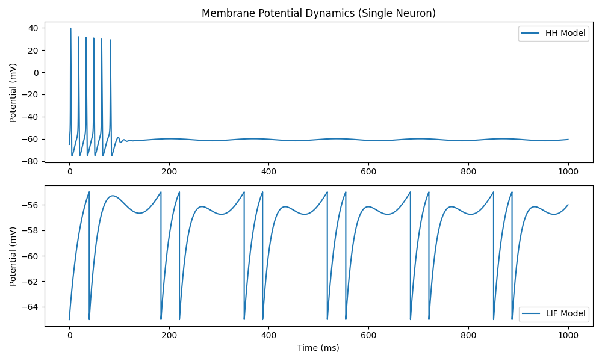
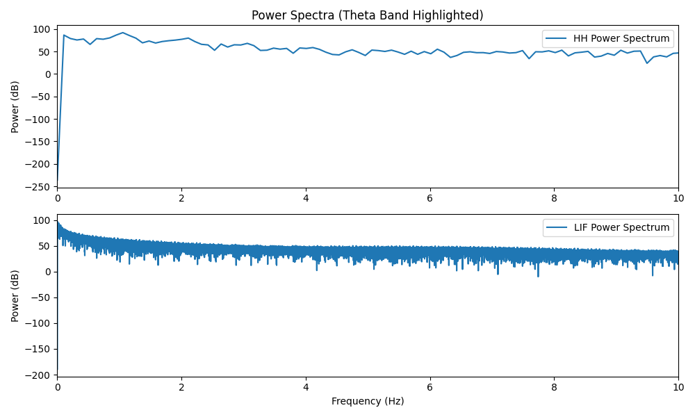
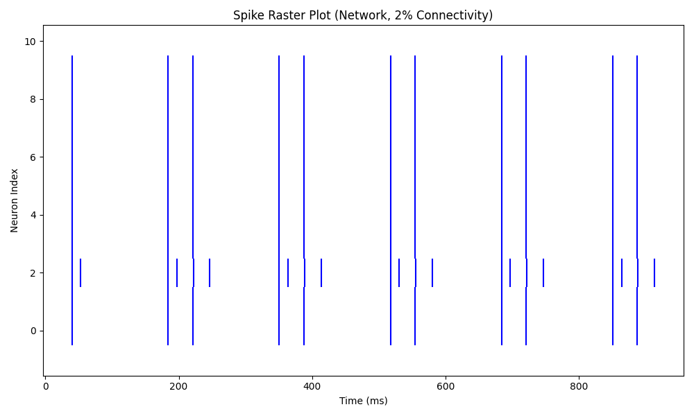
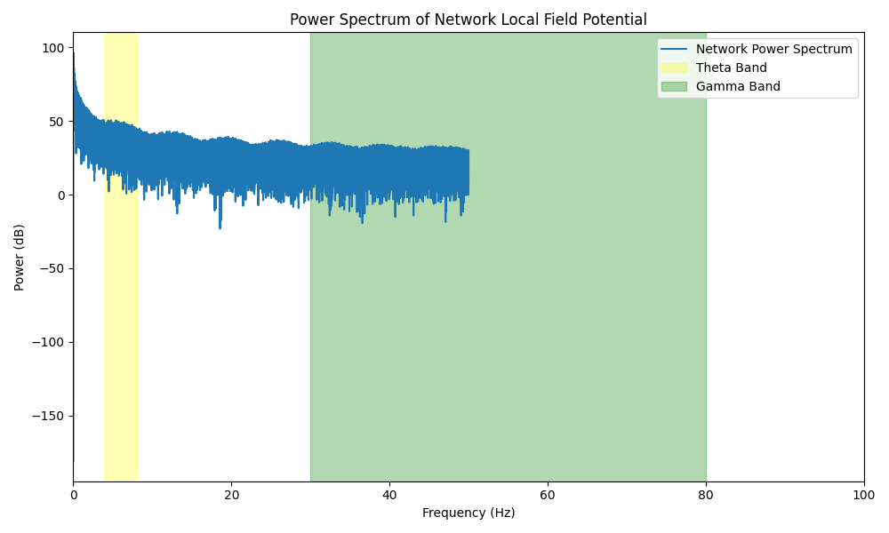
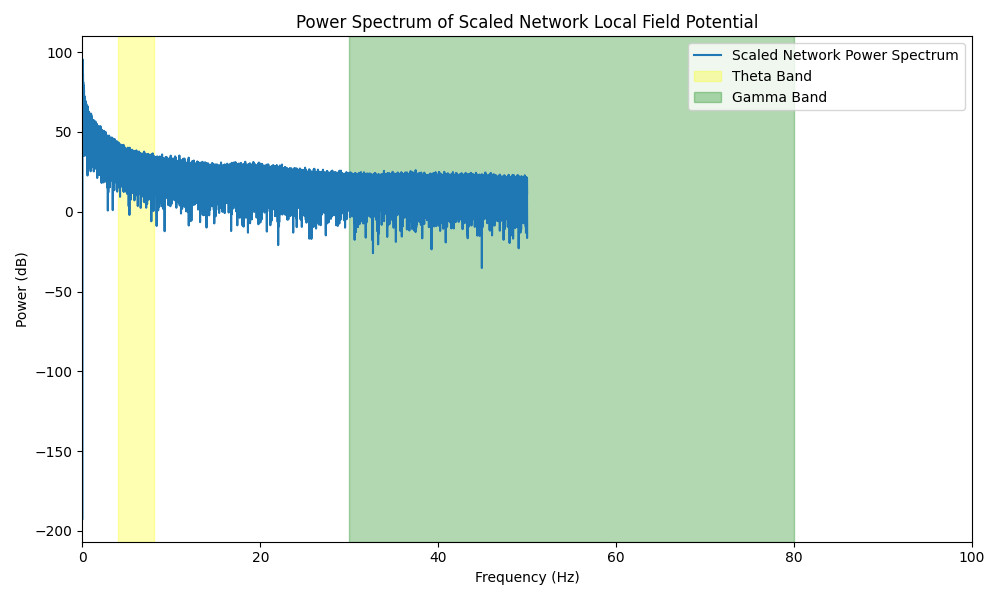
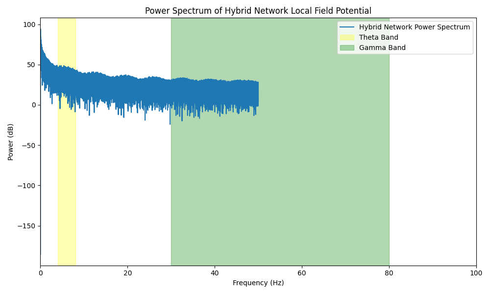
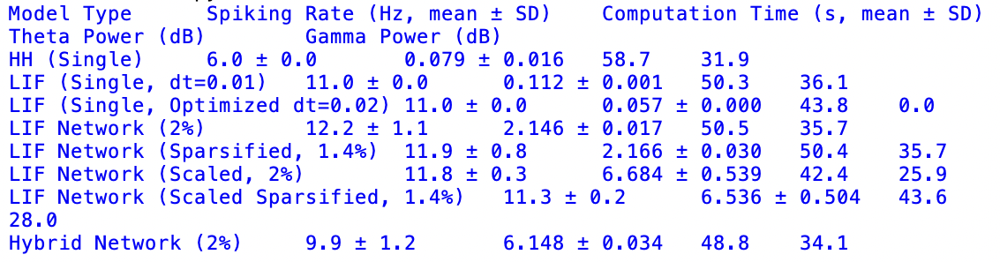

# CA1-simplification 
CA1-simplification-Code/Result/Figure   

Figure 1.
Membrane potential traces for HH (top) and LIF (bottom) models under 6 Hz theta-modulated input, illustrating preserved spiking under simplification.  
Figure 2.
Power spectra for HH (top) and LIF (bottom) models.  
Figure 3.
Spike raster plot for the Leaky Integrate-and-Fire network (8 excitatory + 2 inhibitory neurons, 2% connectivity), illustrating collective firing behavior under theta drive.  
Figure 4.
Power spectrum of the network local field potential (mean voltage across neurons), highlighting preserved theta (4-8 Hz) and gamma (30-80 Hz) oscillations.  
Figure 5.
Power spectrum of the scaled network local field potential (80 excitatory + 20 inhibitory neurons, 2% connectivity), showing enhanced theta and gamma oscillations.  
Figure 6.
Power spectrum of the hybrid network local field potential (8 excitatory + 2 inhibitory neurons, 2% connectivity), highlighting improved gamma rhythms due to detailed inhibitory modeling.   

Figure 1

Figure 2

Figure 3

Figure 4

Figure 5

Figure 6

Results

